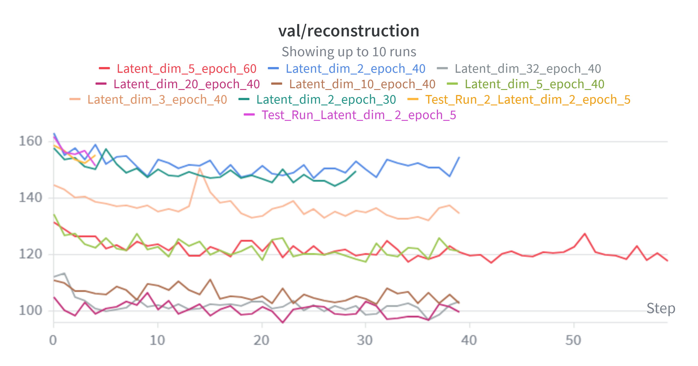
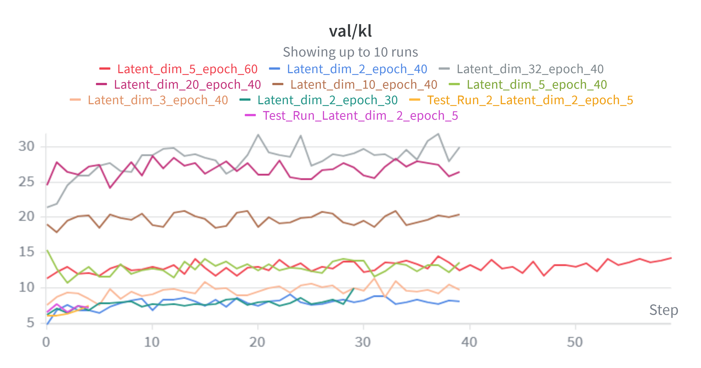
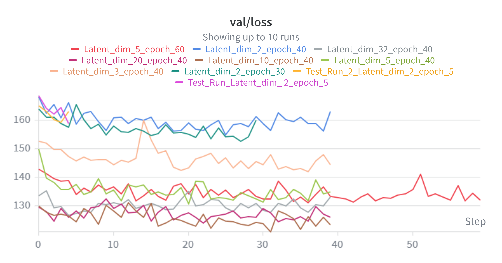
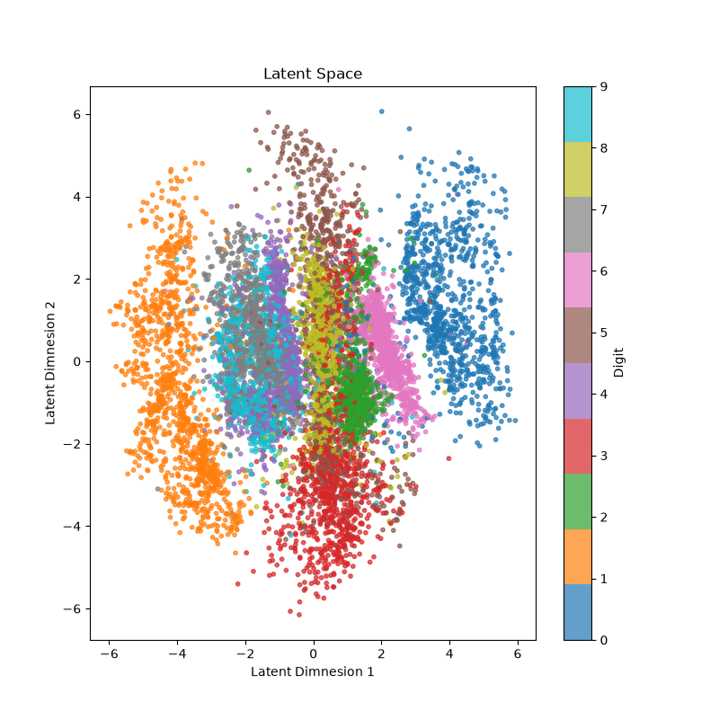
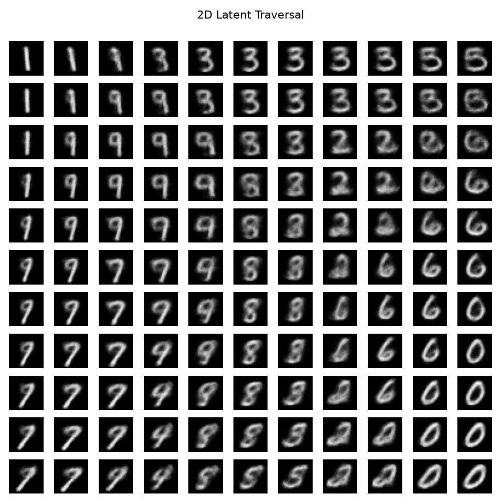
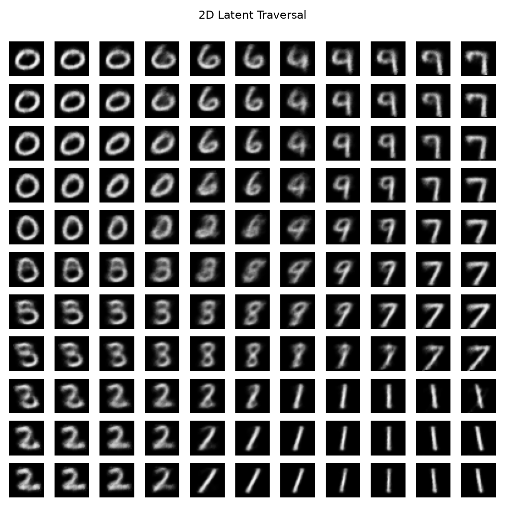
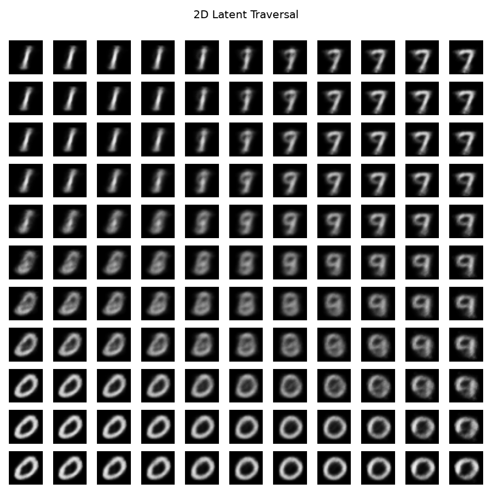

# From VAE to β-VAE: Implementing and Analysing KL Regularization and Latent Disentanglement

A from-scratch implementation of Variational Autoencoders (VAE) and β-VAE on MNIST, studying the effect of KL regularization strength and latent dimensionality on reconstruction quality and latent space structure.

Based on three papers read in sequence:
- Kingma & Welling (2013) — *Auto-Encoding Variational Bayes*
- Higgins et al. (2017) — *β-VAE: Learning Basic Visual Concepts with a Constrained Variational Framework*
- Burgess et al. (2018) — *Understanding Disentangling in β-VAE*

📊 **[Full experiment dashboard on Weights & Biases](https://wandb.ai/shantanushinde-aa15-iit/vae-to-beta-vae?nw=nwusershantanushindeaa15)**

---

## Key Findings

**Latent Dimensionality Study (β = 1.0 fixed)**
- **The reconstruction elbow is at latent_dim = 10** — validation reconstruction loss drops sharply from dim=2 (155.45) to dim=10 (110.96), then flattens significantly through dim=32 (101.32), indicating dim=10 as the practical sweet spot for MNIST
- **Lower dimensions take longer to converge** — dim=5 required 60 epochs vs 40 for dim=10 and above, suggesting lower-dimensional spaces need more training to find compact representations
- **Higher dimensions show better val than train reconstruction** — at dim=10 and dim=20, KL regularization prevents overfitting effectively, producing lower validation reconstruction than training reconstruction

**KL Regularization Study (latent_dim = 2)**
- **KL term is essential for generative structure** — removing the KL term causes the latent space to expand uncontrollably (scale: 0–50 vs ±4), with digit representations stretching into diagonal streaks rather than coherent clusters, confirming the model degenerates to a plain autoencoder without regularization

**β Sweep Study (latent_dim = 2, 40 epochs each)**
- **β = 1.0 produces the richest traversal outputs** — sharpest individual digit reconstructions, widest digit variety (9 distinct types), and smoothest transitions across the latent space
- **β = 4.0 produces the cleanest axis disentanglement** — clearest structural separation between latent dimensions, consistent with Higgins et al. (2017), but at the cost of slightly reduced representational richness
- **Optimal β depends on downstream goal** — β=1.0 for generation quality; β=4.0 for structured disentanglement
- **Collapse threshold is between β=8 and β=16** — β=8 maintains 6 digit types; β=16 collapses to 2, confirming a sharp collapse boundary rather than a gradual degradation
- **Very low β (≤ 0.1) degrades structure without improving reconstruction** — contrary to intuition, β=0.01 produces noisier outputs than β=1.0, showing that some KL regularization improves generation quality even when reconstruction is the primary goal

---

## Results

### Latent Dimensionality Sweep (β = 1.0, 40–60 epochs)

| Latent Dim | Val Recon | Val KL | Val Loss | Epochs to Converge |
|------------|-----------|--------|----------|--------------------|
| 2 | 155.45 | 6.87 | 162.32 | 40 |
| 3 | 134.67 | 9.81 | 144.49 | 40 |
| 5 | 117.73 | 14.31 | 132.04 | 60 |
| **10** | **110.96** | **19.05** | **130.01** | **40** |
| 20 | 105.00 | 24.60 | 129.60 | 40 |
| 32 | 101.32 | 26.64 | 127.96 | 40 |

Reconstruction gain per step:
```
dim 2  → 5  :  -37.72  (large)
dim 5  → 10 :   -6.77  (meaningful)
dim 10 → 20 :   -5.96  (diminishing)
dim 20 → 32 :   -3.68  (marginal)
```

### β Sweep Summary (latent_dim = 2, 40 epochs)

| β | Reconstruction Quality | Latent Structure | Digit Variety in Traversal |
|---|---|---|---|
| 0.01 | Poor — noisy, blurry | None | Limited (3–4 types) |
| 0.1 | Moderate | Weak | Moderate |
| 0.5 | Good | Developing | Good |
| **1.0** | **Best** | Good | **Richest (9 types)** |
| 2.0 | Good | Strong | Good |
| **4.0** | Good | **Best** | Moderate |
| 8.0 | Declining | Over-regularized | Limited (6 types) |
| 16.0 | Poor | Collapsed | Only 2 types |

---

## Visualizations

📊 Full interactive dashboard: **[Weights & Biases](https://wandb.ai/shantanushinde-aa15-iit/vae-to-beta-vae?nw=nwusershantanushindeaa15)**

All visualizations are logged directly to Weights & Biases during training.

### W&B Loss Curves (Latent Dim Sweep)

**Validation Reconstruction Loss across runs:**
<p align="center">
  
</p>

**Validation KL Divergence across runs:**
<p align="center">
  
</p>

**Validation Loss across runs:**
<p align="center">
  
</p>

### 2D Latent Space (β = 1.0, latent_dim = 2)

<p align="center">
  
</p>

### Latent Space — With vs Without KL Regularization

| Property | With KL (VAE) | Without KL (Autoencoder) |
|---|---|---|
| Scale | ±4 — controlled | 0–50 — uncontrolled |
| Structure | Smooth overlapping clusters | Stretched diagonal streaks |
| Generative? | Yes — sample from N(0,1) | No — space is arbitrary |

### 2D Latent Traversal Comparison

**β = 1.0 — Best reconstruction quality, richest digit variety (9 types)**
<p align="center">
  
</p>

**β = 4.0 — Cleanest axis disentanglement (Higgins et al. sweet spot)**
<p align="center">
  
</p>

**β = 16.0 — Posterior collapse: only 2 digit types remain**
<p align="center">
  
</p>

---

## Overview

This project implements VAE and β-VAE from scratch, deriving the ELBO loss and reparameterization trick directly from Kingma & Welling (2013), and studies two experimental axes:

1. **Latent dimensionality** — how much capacity does the latent space need to represent MNIST digits?
2. **β regularization strength** — what is the tradeoff between reconstruction quality, latent structure, and representational richness?

All experiments tracked with Weights & Biases. Best model checkpoints saved automatically per run.

---

## Project Structure

```
BETA_VAE_MNIST/
│
├── configs/
│   ├── dataset.py             # Dataset configuration
│   ├── evaluation_config.py   # Evaluation configuration
│   ├── model.py               # Model hyperparameters
│   ├── training.py            # Training configuration
│   └── wandb.py               # W&B configuration
│
├── data/
│   ├── MNIST/raw              # Auto-downloaded MNIST files
│   └── mnist.py               # MNIST DataModule
│
├── evaluation/
│   └── evaluator.py           # Evaluation pipeline
│
├── models/
│   ├── activations.py         # Custom activation functions
│   ├── output.py              # Model output dataclass
│   └── vae.py                 # VAE architecture
│
├── outputs/
│   ├── checkpoints/           # Best model checkpoints per run
│   └── images/                # Loss plots
│
├── results/                   # Images embedded in README
│   ├── val_recon.png
│   ├── val_kl.png
│   ├── val_loss.png
│   ├── latent_space.png
│   ├── traversal_beta1.png
│   ├── traversal_beta4.png
│   └── traversal_beta16.png
│
├── training/
│   ├── checkpoints.py         # Checkpoint saving logic
│   ├── losses.py              # ELBO loss (reconstruction + KL)
│   └── trainer.py             # Modular training loop
│
├── utils/
│   ├── checkpoints.py         # Checkpoint loading utilities
│   ├── logger.py              # Logging utilities
│   ├── seeds.py               # Reproducibility seeding
│   └── visualize.py           # Visualization utilities
│
├── visualization/
│   ├── latent.py              # 2D latent space visualization
│   ├── reconstruction.py      # Reconstruction visualization
│   └── sampling.py            # Random sample generation
│
├── wandb/                     # W&B local run cache
├── inference.py               # Inference pipeline
├── test_evaluate.py           # Evaluation script
├── train.py                   # Training entry point
├── README.md
├── requirements.txt
└── .gitignore
```

---

## Installation

```bash
git clone https://github.com/gladiator-13/VAE_to_Beta_VAE
cd VAE_to_Beta_VAE
python -m venv venv
source venv/bin/activate        # Windows: venv\Scripts\activate
pip install -r requirements.txt
```

---

## Usage

### Train

```bash
python train.py
```

### Evaluate

```bash
python test_evaluate.py
```

### Inference

```bash
python inference.py
```

---

## Experiment Tracking

All runs logged to Weights & Biases under project `vae-to-beta-vae`.

Each run tracks:
- `train/loss`, `val/loss` — total ELBO loss
- `train/reconstruction`, `val/reconstruction` — reconstruction term
- `train/kl`, `val/kl` — KL divergence term
- Reconstruction image grids every 5 epochs
- Random sample grids from prior N(0,1)
- 2D latent space scatter plot (digit-coloured)

Best model checkpoints saved automatically to `outputs/checkpoints/` per run.

---

## Stack

- Python
- PyTorch
- Weights & Biases
- torchvision
- matplotlib

---

## Roadmap

- [x] VAE implementation from scratch (ELBO, reparameterization trick)
- [x] MNIST DataModule
- [x] Modular trainer with validation loop
- [x] W&B experiment tracking
- [x] Automatic best model checkpointing
- [x] Reconstruction visualization
- [x] Random sample generation
- [x] 2D latent space visualization
- [x] Latent dimensionality sweep (dim = 2, 3, 5, 10, 20, 32)
- [x] β-VAE implementation
- [x] β sweep (β = 0.01, 0.1, 0.5, 1.0, 2.0, 4.0, 8.0, 16.0)
- [x] 2D latent traversal across all β values
- [ ] Latent interpolation
- [ ] Disentanglement metric (latent traversal at dim=10)

---

## References

- Kingma, D. P., & Welling, M. (2013). *Auto-Encoding Variational Bayes*. arXiv:1312.6114
- Higgins, I., et al. (2017). *β-VAE: Learning Basic Visual Concepts with a Constrained Variational Framework*. ICLR 2017
- Burgess, C., et al. (2018). *Understanding Disentangling in β-VAE*. arXiv:1804.03599

---

## License

For educational and research purposes.
